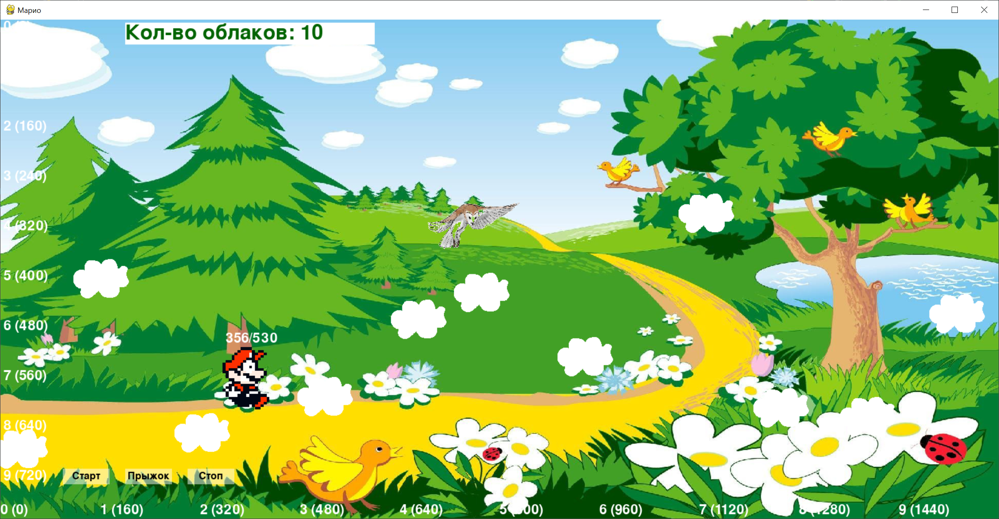

# mario

- [pygame-tutorial](https://mrtsepa.gitbooks.io/pygame-tutorial/content/reference/pygame/events.html)
- [pygame modules](https://proproprogs.ru/modules/klass-rect-ego-rol-svoystva-i-metody?ysclid=lztv9uky1q741635320)

