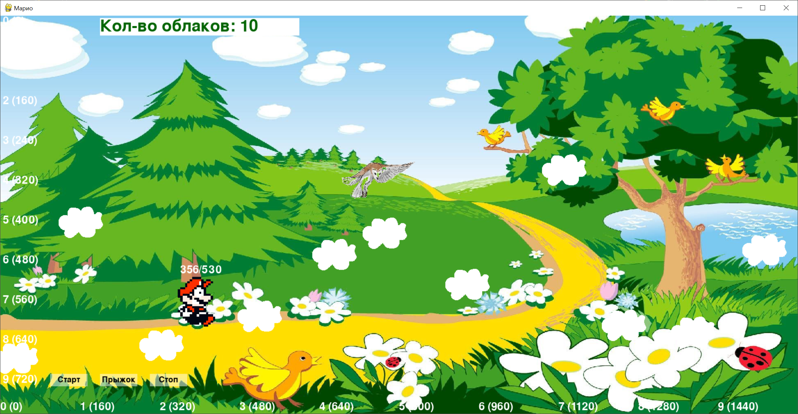
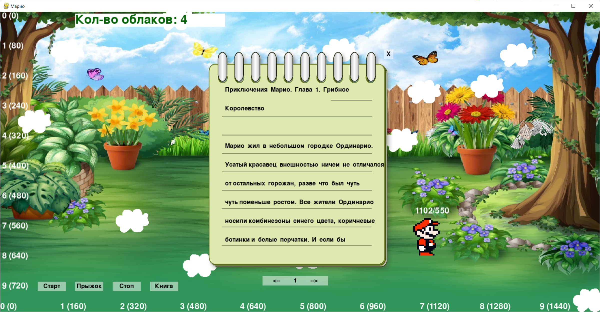
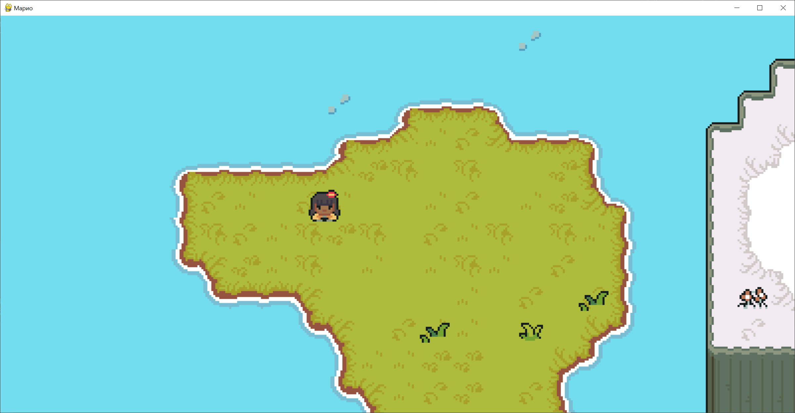

# mario

- [pygame-tutorial](https://mrtsepa.gitbooks.io/pygame-tutorial/content/reference/pygame/events.html)
- [pygame modules](https://proproprogs.ru/modules/klass-rect-ego-rol-svoystva-i-metody?ysclid=lztv9uky1q741635320)
- [Приключения Марио. Глава 1. Грибное Королевство](https://proza.ru/2013/06/17/1053?ysclid=lzvcgzuzst571387686)

### Git
https://github.com/VitaliyPavlyukov/mario

